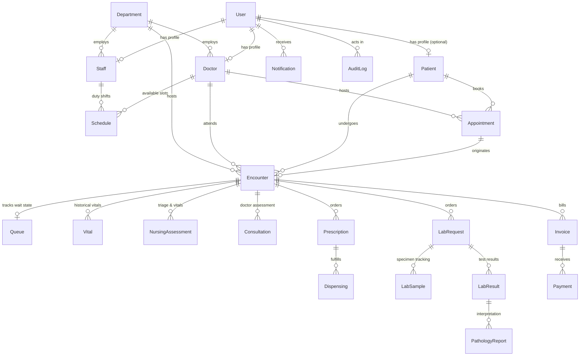

# CareSync Database Schema & Architecture Foundation

CareSync uses MongoDB with Mongoose to implement a healthcare data platform with clear entity boundaries, strong index protection, and strict adherence to the clinical encounter paradigm.

---

## 1. Architectural Philosophy

1. **Patient -> Encounter -> Clinical Records Hierarchy**  
   A `Patient` record represents an individual's persistent identity and demographics. Medical history is **never** stored as unbounded nested arrays inside the patient document.  
   Instead, every clinical event occurs within a discrete `Encounter`. All clinical records (`Vital`, `NursingAssessment`, `Consultation`, `Prescription`, `LabRequest`, `Dispensing`, `Invoice`, `Payment`) belong to an `Encounter`.

2. **Clean Separation of Identity & Profiles**  
   - `User` represents the authoritative authentication identity (`email`, `passwordHash`, `role`, `status`).  
   - Clinical and operational staff roles point back to `User` via `userId` (`Doctor`, `Staff`, and optionally `Patient`).  
   - The authoritative authentication role remains in `User.role`.

3. **Clinical Ownership of Prescriptions**  
   - Prescriptions are authored and owned by a licensed prescribing physician (`Doctor`).  
   - Dispensary actions are tracked in a separate `Dispensing` collection referencing the prescription, encounter, patient, and fulfilling pharmacist.

4. **Financial Decoupling & No Discharge Models**  
   - Billing is strictly ledger-oriented: `Invoice`, `Payment`, and balance calculations.  
   - There is **no discharge model**, **no discharge status**, and **no discharge workflow**.

---

## 2. Entity Relationship Diagram (ERD)

---

## 3. Collections & Models Breakdown

### 3.1 Identity & Access

#### `User` (`src/models/User.ts`)
Authoritative authentication identity. Passwords are never stored in plain text and `passwordHash` is excluded from JSON serializations by default.
- **Fields**:
  - `_id`: ObjectId
  - `name`: String (required, trimmed)
  - `email`: String (required, normalized lowercase, unique, trimmed)
  - `phone`: String (optional)
  - `passwordHash`: String (required, hidden from default selects)
  - `role`: Enum (`PATIENT`, `RECEPTIONIST`, `NURSE`, `DOCTOR`, `LAB_TECHNICIAN`, `PATHOLOGIST`, `PHARMACIST`, `BILLING_STAFF`, `ADMIN`)
  - `status`: Enum (`ACTIVE`, `INACTIVE`, `SUSPENDED`)
  - `profileType`: String (`Doctor`, `Staff`, `Patient`)
  - `profileId`: ObjectId (Ref to specific role profile document)
  - `lastLoginAt`: Date
  - `createdAt`, `updatedAt`: Timestamps
- **Indexes**:
  - `{ email: 1 }` (unique)
  - `{ role: 1, status: 1 }`

---

### 3.2 Clinical Profiles & Organizational Structure

#### `Staff` (`src/models/Staff.ts`)
Represents non-doctor hospital staff profiles (Receptionist, Nurse, Lab Tech, Pathologist, Pharmacist, Billing Staff).
- **Fields**:
  - `_id`: ObjectId
  - `userId`: ObjectId (Ref: `User`, index)
  - `employeeId`: String (unique, uppercase)
  - `firstName`: String
  - `lastName`: String
  - `fullName`: String
  - `phone`: String
  - `email`: String (lowercase)
  - `departmentId`: ObjectId (Ref: `Department`)
  - `department`: String
  - `designation`: String
  - `joiningDate`: Date
  - `status`: Enum (`ACTIVE`, `INACTIVE`, `ON_LEAVE`)
  - `shift`: String
  - `emergencyContact`, `qualifications`, `notes`: String
  - `createdAt`, `updatedAt`: Timestamps
- **Indexes**:
  - `{ employeeId: 1 }` (unique)
  - `{ userId: 1 }`
  - `{ departmentId: 1, status: 1 }`

#### `Doctor` (`src/models/Doctor.ts`)
Doctor profiles with licensing, consultation fees, and departmental assignments.
- **Fields**:
  - `_id`: ObjectId
  - `userId`: ObjectId (Ref: `User`, index)
  - `doctorId`: String (unique, uppercase)
  - `firstName`: String
  - `lastName`: String
  - `name`: String
  - `specialization`: String (primary specialty description)
  - `departmentId`: ObjectId (Ref: `Department`, index)
  - `department`: String
  - `licenseNumber`: String (unique, licensed physician credential)
  - `phone`: String
  - `email`: String
  - `consultationFee`: Number (minimum 0)
  - `qualification`: String
  - `roomNumber`: String
  - `availableDays`: Array of Strings
  - `workingHours`: `{ start: String, end: String }`
  - `slotDurationMinutes`: Number
  - `status`: Enum (`ACTIVE`, `INACTIVE`, `ON_LEAVE`)
  - `createdAt`, `updatedAt`: Timestamps
- **Indexes**:
  - `{ doctorId: 1 }` (unique)
  - `{ userId: 1 }`
  - `{ licenseNumber: 1 }`
  - `{ departmentId: 1, status: 1 }`

#### `Patient` (`src/models/Patient.ts`)
Patient identity and demographics. Does **not** contain embedded historical medical arrays.
- **Fields**:
  - `_id`: ObjectId
  - `userId`: ObjectId (Ref: `User`, optional sparse index for unauthenticated walk-in registrations)
  - `patientId`: String (unique, uppercase, e.g. `PAT-10023`)
  - `mrn`: String (Medical Record Number alias)
  - `firstName`: String
  - `lastName`: String
  - `dateOfBirth`: Date
  - `gender`: Enum (`male`, `female`, `other`)
  - `bloodGroup`: Enum (`A+`, `A-`, `B+`, `B-`, `AB+`, `AB-`, `O+`, `O-`)
  - `phone`: String (index)
  - `email`: String (lowercase)
  - `address`: `{ street, city, state, postalCode }`
  - `allergies`: Array of Strings
  - `emergencyContact`: `{ name, relationship, phone }`
  - `insurance`: `{ provider, policyNumber, groupNumber, expiryDate }`
  - `primaryDoctorId`: ObjectId (Ref: `Doctor`)
  - `status`: Enum (`ACTIVE`, `INACTIVE`)
  - `createdAt`, `updatedAt`: Timestamps
- **Indexes**:
  - `{ patientId: 1 }` (unique)
  - `{ phone: 1 }`
  - `{ userId: 1 }` (sparse)
  - `{ status: 1 }`

#### `Department` (`src/models/Department.ts`)
Hospital clinical departments (e.g. Cardiology, General Medicine, Pathology).
- **Fields**:
  - `_id`: ObjectId
  - `name`: String (unique, trimmed)
  - `code`: String (unique, uppercase)
  - `description`: String
  - `headOfDepartment`: String
  - `headDoctorId`: ObjectId (Ref: `Doctor`)
  - `location`: String
  - `status`: Enum (`ACTIVE`, `INACTIVE`)
  - `createdAt`, `updatedAt`: Timestamps
- **Indexes**:
  - `{ name: 1 }` (unique)
  - `{ status: 1 }`

#### `Schedule` (`src/models/Schedule.ts`)
Working availability and duty shifts for doctors and staff. Distinct from appointments.
- **Fields**:
  - `_id`: ObjectId
  - `userId`: ObjectId (Ref: `User`, index)
  - `doctorId`: ObjectId (Ref: `Doctor`, index)
  - `staffId`: ObjectId (Ref: `Staff`, index)
  - `dayOfWeek`: String (`Monday` - `Sunday`)
  - `startTime`: String (e.g. `09:00 AM`)
  - `endTime`: String (e.g. `05:00 PM`)
  - `shiftType`: Enum (`morning`, `afternoon`, `evening`, `night`, `full_day`, `on_call`)
  - `isAvailable`: Boolean (default `true`)
  - `createdAt`, `updatedAt`: Timestamps
- **Indexes**:
  - `{ doctorId: 1, dayOfWeek: 1, isAvailable: 1 }`
  - `{ userId: 1, isAvailable: 1 }`

---

### 3.3 Patient Flow & Clinical Encounter

#### `Appointment` (`src/models/Appointment.ts`)
Patient appointments across in-person and digital modalities. Unified collection for patient and reception bookings.
- **Fields**:
  - `_id`: ObjectId
  - `appointmentId`: String (unique, index, e.g. `APT-10023`)
  - `patientId`: ObjectId (Ref: `Patient`, required, index)
  - `doctorId`: ObjectId (Ref: `Doctor`, required, index)
  - `departmentId`: ObjectId (Ref: `Department`, index)
  - `date`: Date (required, index)
  - `startTime`: String
  - `endTime`: String
  - `timeSlot`: String
  - `reason`: String (required)
  - `bookedBy`: Enum (`PATIENT`, `RECEPTIONIST`)
  - `status`: Enum (`SCHEDULED`, `CONFIRMED`, `CHECKED_IN`, `IN_QUEUE`, `IN_PROGRESS`, `COMPLETED`, `CANCELLED`, `NO_SHOW`)
  - `createdAt`, `updatedAt`: Timestamps
- **Indexes**:
  - `{ patientId: 1 }`
  - `{ doctorId: 1 }`
  - `{ date: 1 }`
  - `{ status: 1 }`
  - `{ doctorId: 1, date: 1, status: 1 }`

#### `Encounter` (`src/models/Encounter.ts`)
The clinical foundation representing an individual patient visit. All visit-scoped events link directly to this document.
- **Fields**:
  - `_id`: ObjectId
  - `encounterId`: String (unique, index, e.g. `ENC-10023`)
  - `patientId`: ObjectId (Ref: `Patient`, required, index)
  - `appointmentId`: ObjectId (Ref: `Appointment`, index)
  - `doctorId`: ObjectId (Ref: `Doctor`, required, index)
  - `departmentId`: ObjectId (Ref: `Department`, index)
  - `visitDate`: Date (required, index)
  - `visitType`: Enum (`OPD`, `FOLLOW_UP`, `EMERGENCY`, `ROUTINE`)
  - `reason`: String
  - `diagnosis`: String
  - `summary`: String
  - `internalNotes`: String
  - `status`: Enum (`IN_PROGRESS`, `COMPLETED`, `CANCELLED`)
  - `createdAt`, `updatedAt`: Timestamps
- **Indexes**:
  - `{ encounterId: 1 }` (unique)
  - `{ patientId: 1 }`
  - `{ visitDate: 1 }`
  - `{ doctorId: 1, visitDate: -1 }`

#### `Queue` (`src/models/Queue.ts`)
Tracks outpatient waiting status, triage priority, and real-time station flow during an encounter.
- **Fields**:
  - `_id`: ObjectId
  - `encounterId`: ObjectId (Ref: `Encounter`, index)
  - `patientId`: ObjectId (Ref: `Patient`, required, index)
  - `doctorId`: ObjectId (Ref: `Doctor`, required, index)
  - `appointmentId`: ObjectId (Ref: `Appointment`, index)
  - `ticketNumber`: String (e.g. `Q-104`)
  - `department`: String
  - `roomNumber`: String
  - `status`: Enum (`WAITING`, `IN_ASSESSMENT`, `READY_FOR_DOCTOR`, `IN_CONSULTATION`, `COMPLETED`)
  - `priority`: Enum (`NORMAL`, `PRIORITY`, `URGENT`)
  - `source`: Enum (`appointment`, `walk-in`)
  - `checkedInAt`: Date (index)
  - `startedAt`: Date
  - `completedAt`: Date
  - `createdAt`, `updatedAt`: Timestamps
- **Indexes**:
  - `{ doctorId: 1, status: 1, checkedInAt: 1 }`
  - `{ encounterId: 1 }`

---

### 3.4 Clinical Observations & Directives

#### `Vital` (`src/models/Vital.ts`)
Vitals tied to a specific Encounter and Patient. Supports full chronological trend analysis across visits.
- **Fields**:
  - `_id`: ObjectId
  - `encounterId`: ObjectId (Ref: `Encounter`, index)
  - `patientId`: ObjectId (Ref: `Patient`, required, index)
  - `recordedBy`: ObjectId (Ref: `User`, index)
  - `bloodPressure`: String (e.g. `120/80`)
  - `heartRate`: Number (bpm)
  - `spo2`: Number (% SpO2)
  - `temperature`: Number (°F or °C)
  - `respiratoryRate`: Number (breaths/min)
  - `weight`: Number (kg)
  - `height`: Number (cm)
  - `painScore`: Number (0-10)
  - `recordedAt`: Date (index)
  - `createdAt`: Timestamp
- **Indexes**:
  - `{ patientId: 1, recordedAt: -1 }`
  - `{ encounterId: 1 }`

#### `NursingAssessment` (`src/models/NursingAssessment.ts`)
Nurse intake triage, observations, mobility assessments, and physician handoff directives.
- **Fields**:
  - `_id`: ObjectId
  - `encounterId`: ObjectId (Ref: `Encounter`, index)
  - `patientId`: ObjectId (Ref: `Patient`, required, index)
  - `nurseId`: ObjectId (Ref: `User`, index)
  - `chiefComplaint`: String
  - `symptoms`: Array of Strings
  - `observations`: String
  - `condition`: String (`stable`, `critical`, `needs-monitoring`, `acute`)
  - `mobility`: String (`independent`, `assisted`, `wheelchair`, `stretcher`, `bedridden`)
  - `pain`: String or Number
  - `notes`: String
  - `priority`: String (`normal`, `priority`, `urgent`)
  - `doctorHandoff`: String
  - `status`: Enum (`DRAFT`, `COMPLETED`)
  - `createdAt`, `updatedAt`: Timestamps
- **Indexes**:
  - `{ encounterId: 1 }`
  - `{ patientId: 1, createdAt: -1 }`

#### `Consultation` (`src/models/Consultation.ts`)
Doctor's formal clinical examination, diagnosis, differential notes, and treatment plan.
- **Fields**:
  - `_id`: ObjectId
  - `encounterId`: ObjectId (Ref: `Encounter`, index)
  - `patientId`: ObjectId (Ref: `Patient`, required, index)
  - `doctorId`: ObjectId (Ref: `Doctor`, required, index)
  - `chiefComplaint`: String
  - `clinicalFindings`: String
  - `diagnosis`: String
  - `treatmentPlan`: String
  - `notes`: String
  - `followUpRequired`: Boolean
  - `followUpDate`: Date
  - `status`: Enum (`DRAFT`, `COMPLETED`)
  - `createdAt`, `updatedAt`: Timestamps
- **Indexes**:
  - `{ encounterId: 1 }`
  - `{ patientId: 1, createdAt: -1 }`
  - `{ doctorId: 1, createdAt: -1 }`

#### `Prescription` (`src/models/Prescription.ts`)
Doctor-authored medication orders belonging to the clinical encounter.
- **Fields**:
  - `_id`: ObjectId
  - `prescriptionId`: String (unique, index, e.g. `RX-10023`)
  - `encounterId`: ObjectId (Ref: `Encounter`, index)
  - `patientId`: ObjectId (Ref: `Patient`, required, index)
  - `doctorId`: ObjectId (Ref: `Doctor`, required, index)
  - `items`: Array of:
    - `medicineId`: ObjectId (Ref: `Medicine`)
    - `medicineName`: String
    - `dosage`: String (e.g. `500mg`)
    - `frequency`: String (e.g. `Twice daily`)
    - `duration`: String (e.g. `5 days`)
    - `instructions`: String
    - `refillsRemaining`: Number
  - `instructions`: String (general patient-facing directions)
  - `status`: Enum (`ACTIVE`, `PENDING`, `REVIEWED`, `DISPENSED`, `COMPLETED`, `CANCELLED`, `DISCONTINUED`)
  - `createdAt`, `updatedAt`: Timestamps
- **Indexes**:
  - `{ prescriptionId: 1 }` (unique)
  - `{ encounterId: 1 }`
  - `{ patientId: 1, date: -1 }`
  - `{ doctorId: 1, date: -1 }`
  - `{ status: 1 }`

---

### 3.5 Laboratory & Diagnostics

The diagnostic pipeline strictly follows this sequence:
`Consultation -> LabRequest -> LabSample -> LabResult -> PathologyReport`.

#### `LabRequest` (`src/models/LabRequest.ts`)
Doctor's laboratory requisition for diagnostic testing.
- **Fields**:
  - `_id`: ObjectId
  - `requestId`: String (unique, index, e.g. `LRQ-10023`)
  - `encounterId`: ObjectId (Ref: `Encounter`, required, index)
  - `patientId`: ObjectId (Ref: `Patient`, required, index)
  - `doctorId`: ObjectId (Ref: `Doctor`, required, index)
  - `tests`: Array of `{ testName, department, reason, instructions }`
  - `priority`: Enum (`ROUTINE`, `URGENT`, `STAT`)
  - `status`: Enum (`REQUESTED`, `SAMPLE_COLLECTED`, `PROCESSING`, `RESULTS_ENTERED`, `COMPLETED`, `CANCELLED`)
  - `notes`: String
  - `createdAt`, `updatedAt`: Timestamps
- **Indexes**:
  - `{ requestId: 1 }` (unique)
  - `{ encounterId: 1 }`
  - `{ patientId: 1, createdAt: -1 }`
  - `{ doctorId: 1 }`
  - `{ status: 1 }`

#### `LabSample` (`src/models/LabSample.ts`)
Phlebotomy/specimen collection tracking and laboratory barcoding.
- **Fields**:
  - `_id`: ObjectId
  - `sampleId`: String (unique, index, e.g. `SMP-10023`)
  - `labRequestId`: ObjectId (Ref: `LabRequest`, index)
  - `patientId`: ObjectId (Ref: `Patient`, required, index)
  - `encounterId`: ObjectId (Ref: `Encounter`, index)
  - `specimenType`: String (e.g. `Venous Blood`, `Serum`, `Urine`)
  - `tubeType`: String (e.g. `Lavender Top (EDTA)`)
  - `barcode`: String (unique token, index)
  - `status`: Enum (`PENDING`, `COLLECTED`, `PROCESSING`, `ANALYZED`, `STORED`, `DISPOSED`, `REJECTED`)
  - `collectedAt`: Date
  - `collectedBy`: String
  - `storageLocation`: String
  - `volume`: String
  - `createdAt`, `updatedAt`: Timestamps
- **Indexes**:
  - `{ sampleId: 1 }` (unique)
  - `{ barcode: 1 }` (unique)
  - `{ labRequestId: 1 }`
  - `{ encounterId: 1 }`
  - `{ patientId: 1 }`

#### `LabResult` (`src/models/LabResult.ts`)
Quantitative and qualitative analyzer results entered by laboratory technicians.
- **Fields**:
  - `_id`: ObjectId
  - `resultId`: String (unique, index, e.g. `LRS-10023`)
  - `labRequestId`: ObjectId (Ref: `LabRequest`, required, index)
  - `sampleId`: ObjectId (Ref: `LabSample`, index)
  - `patientId`: ObjectId (Ref: `Patient`, required, index)
  - `results`: Array of `{ parameter, value, unit, referenceRange, flag }`
  - `enteredBy`: ObjectId (Ref: `User`)
  - `enteredAt`: Date
  - `status`: Enum (`ENTERED`, `VERIFIED`, `COMPLETED`, `CORRECTION_REQUIRED`)
  - `notes`: String
  - `createdAt`, `updatedAt`: Timestamps
- **Indexes**:
  - `{ resultId: 1 }` (unique)
  - `{ labRequestId: 1 }`
  - `{ sampleId: 1 }`
  - `{ patientId: 1, createdAt: -1 }`

#### `PathologyReport` (`src/models/PathologyReport.ts`)
Pathologist's diagnostic evaluation, microscopic findings, and clinical correlation.
- **Fields**:
  - `_id`: ObjectId
  - `reportId`: String (unique, index, e.g. `PTH-10023`)
  - `labResultId`: ObjectId (Ref: `LabResult`, index)
  - `labRequestId`: ObjectId (Ref: `LabRequest`, index)
  - `patientId`: ObjectId (Ref: `Patient`, required, index)
  - `pathologistId`: ObjectId (Ref: `User`, index)
  - `findings`: String
  - `interpretation`: String
  - `comments`: String
  - `clinicalCorrelation`: String
  - `status`: Enum (`DRAFT`, `VERIFIED`, `FINALIZED`, `CORRECTION_REQUESTED`)
  - `verifiedAt`: Date
  - `createdAt`, `updatedAt`: Timestamps
- **Indexes**:
  - `{ reportId: 1 }` (unique)
  - `{ labResultId: 1 }`
  - `{ labRequestId: 1 }`
  - `{ patientId: 1, createdAt: -1 }`
  - `{ pathologistId: 1 }`

---

### 3.6 Pharmacy & Inventory

#### `Medicine` (`src/models/Medicine.ts`)
Formulary item inventory and stock threshold tracking.
- **Fields**:
  - `_id`: ObjectId
  - `medicineId`: String (unique, index, e.g. `MED-1024`)
  - `name`: String (required, index)
  - `genericName`: String
  - `unit`: String (e.g. `tablets`, `capsules`, `bottles`, `vials`)
  - `availableQuantity`: Number (required, min 0)
  - `lowStockThreshold`: Number (required, min 1)
  - `category`: String
  - `unitPrice`: Number
  - `location`: String (e.g. `Rack B-02`)
  - `status`: Enum (`AVAILABLE`, `LOW_STOCK`, `OUT_OF_STOCK`)
  - `createdAt`, `updatedAt`: Timestamps
- **Indexes**:
  - `{ medicineId: 1 }` (unique)
  - `{ name: 1 }`
  - `{ status: 1 }`

#### `Dispensing` (`src/models/Dispensing.ts`)
Pharmacy dispensing log confirming medication fulfillment against an active prescription.
- **Fields**:
  - `_id`: ObjectId
  - `dispenseId`: String (unique, index, e.g. `DSP-10023`)
  - `prescriptionId`: ObjectId (Ref: `Prescription`, required, index)
  - `encounterId`: ObjectId (Ref: `Encounter`, index)
  - `patientId`: ObjectId (Ref: `Patient`, required, index)
  - `pharmacistId`: ObjectId (Ref: `User`, index)
  - `items`: Array of:
    - `medicineId`: ObjectId (Ref: `Medicine`)
    - `medicineName`: String
    - `dosage`, `frequency`, `duration`: String
    - `quantityDispensed`: Number
    - `unit`: String
    - `instructions`, `batchNumber`: String
  - `status`: Enum (`DISPENSED`, `PREPARING`, `PARTIALLY_DISPENSED`, `COMPLETED`, `CANCELLED`)
  - `dispensedAt`: Date (index)
  - `createdAt`, `updatedAt`: Timestamps
- **Indexes**:
  - `{ dispenseId: 1 }` (unique)
  - `{ prescriptionId: 1 }`
  - `{ encounterId: 1 }`
  - `{ patientId: 1, dispensedAt: -1 }`

---

### 3.7 Financial & Billing

Billing is ledger-based: charges are aggregated into an `Invoice` and fulfilled through `Payment` entries. There is no discharge model.

#### `Invoice` (`src/models/Invoice.ts`)
Financial statement for clinical services, lab tests, and dispensed medications.
- **Fields**:
  - `_id`: ObjectId
  - `invoiceId`: String (unique, index, e.g. `INV-10023`)
  - `patientId`: ObjectId (Ref: `Patient`, required, index)
  - `encounterId`: ObjectId (Ref: `Encounter`, index)
  - `doctorId`: ObjectId (Ref: `Doctor`, index)
  - `items`: Array of:
    - `serviceName`: String
    - `category`: String (`consultation`, `laboratory`, `pharmacy`, `nursing`, `procedure`)
    - `quantity`: Number
    - `unitPrice`: Number
    - `subtotal`: Number
  - `subtotal`: Number
  - `discount`: Number
  - `taxAmount`: Number
  - `total`: Number
  - `paidAmount`: Number
  - `balanceAmount`: Number
  - `status`: Enum (`UNPAID`, `PARTIALLY_PAID`, `PAID`, `CANCELLED`)
  - `date`: Date (index)
  - `dueDate`: Date
  - `createdAt`, `updatedAt`: Timestamps
- **Indexes**:
  - `{ invoiceId: 1 }` (unique)
  - `{ patientId: 1, date: -1 }`
  - `{ encounterId: 1 }`
  - `{ status: 1 }`

#### `Payment` (`src/models/Payment.ts`)
Transaction record documenting payments applied to an invoice.
- **Fields**:
  - `_id`: ObjectId
  - `paymentId`: String (unique, index, e.g. `TXN-10023`)
  - `invoiceId`: ObjectId (Ref: `Invoice`, required, index)
  - `patientId`: ObjectId (Ref: `Patient`, required, index)
  - `encounterId`: ObjectId (Ref: `Encounter`, index)
  - `amount`: Number (required, min 0.01)
  - `method`: Enum (`cash`, `credit_card`, `debit_card`, `insurance`, `bank_transfer`, `upi`, `cheque`)
  - `transactionReference`: String
  - `status`: Enum (`COMPLETED`, `PENDING`, `REFUNDED`, `FAILED`)
  - `paidAt`: Date (index)
  - `recordedBy`: ObjectId (Ref: `User`)
  - `createdAt`, `updatedAt`: Timestamps
- **Indexes**:
  - `{ paymentId: 1 }` (unique)
  - `{ invoiceId: 1 }`
  - `{ patientId: 1, paidAt: -1 }`
  - `{ encounterId: 1 }`

---

### 3.8 System & Audit Logging

#### `Notification` (`src/models/Notification.ts`)
User-specific real-time notifications.
- **Fields**:
  - `_id`: ObjectId
  - `recipientUserId`: ObjectId (Ref: `User`, index)
  - `title`: String
  - `message`: String
  - `type`: String
  - `relatedResource`: `{ resourceType, resourceId }`
  - `link`: String
  - `isRead`: Boolean (default `false`, index)
  - `createdAt`, `updatedAt`: Timestamps
- **Indexes**:
  - `{ recipientUserId: 1, isRead: 1, createdAt: -1 }`

#### `AuditLog` (`src/models/AuditLog.ts`)
Immutable audit trail capturing all critical mutations across clinical, staff, and financial data.
- **Fields**:
  - `_id`: ObjectId
  - `actorUserId`: ObjectId (Ref: `User`, index)
  - `action`: String (index)
  - `resourceType`: String (index)
  - `resourceId`: String (index)
  - `ipAddress`: String
  - `userAgent`: String
  - `status`: Enum (`success`, `warning`, `failure`)
  - `metadata`: Object
  - `createdAt`: Date (index)
- **Indexes**:
  - `{ actorUserId: 1 }`
  - `{ createdAt: -1 }`
  - `{ resourceType: 1, action: 1 }`
